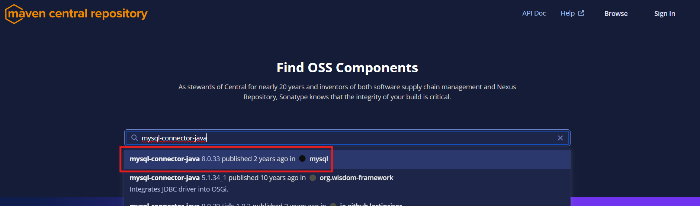
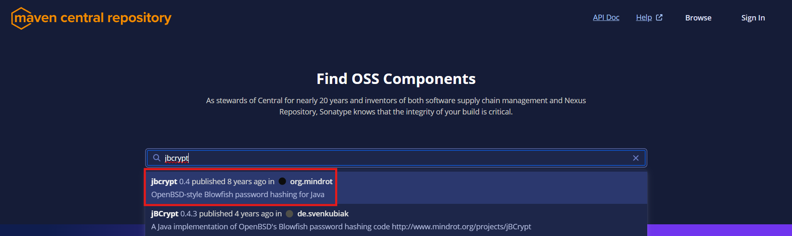
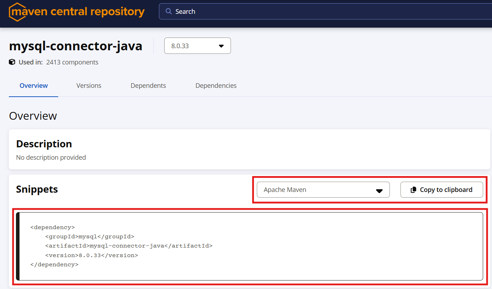
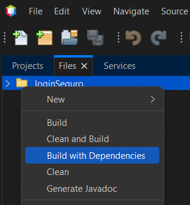

## **Aula: Implementando um Sistema de Login com Hash de Senha em Java Swing (MVC e Maven) no NetBeans**

### **Objetivo da Aula**

- Criar um sistema de login/logout usando **Java Swing**.
- Implementar **hash de senha** ao salvar no banco de dados.
- Seguir o padrão **MVC** para organização do código.
- Utilizar **Maven** para gerenciar dependências.
- Desenvolver a interface gráfica no **NetBeans GUI Builder**.

---

## **1. Criando o Projeto Java Swing com Maven no NetBeans**

### **Passo 1: Criando um novo projeto Maven**

1. Abra o **NetBeans**.
2. Vá em **Arquivo** → **Novo Projeto**.
3. Escolha **Java com Maven** → **Aplicação Java** → **Próximo**.
4. Defina um nome para o projeto e clique em **Finalizar**.

### **Passo 2: Adicionando Dependências**

As dependências do `MySQL` e `BCrypt` podem ser encontradas diretamente no **Maven Central Repository**.

1. Acesse [Maven Central Repository](https://central.sonatype.com/).
2. Pesquise por **mysql-connector-java** e **jbcrypt**.

<figure style="text-align: center;">
    
</figure>

<figure style="text-align: center;">
    
</figure>

3. Copie o código XML da última versão disponível e cole no arquivo `pom.xml`.

<figure style="text-align: center;">
    
</figure>

Exemplo de dependências:

```xml
<dependencies>
    <!-- Conector MySQL -->
    <dependency>
        <groupId>mysql</groupId>
        <artifactId>mysql-connector-java</artifactId>
        <version>8.0.33</version>
    </dependency>
    
    <!-- Biblioteca para hash de senha -->
    <dependency>
        <groupId>org.mindrot</groupId>
        <artifactId>jbcrypt</artifactId>
        <version>0.4</version>
    </dependency>
</dependencies>
```

Depois, clique com o botão direito no projeto e selecione **Build with Dependencies**.

<figure style="text-align: center;">
    
</figure>

---

## **2. Estruturando o Projeto em MVC**

A estrutura de diretórios será:

```
src/main/java/com/exemplo
│── model
│   ├── Conexao.java
│   ├── Usuario.java
│   ├── UsuarioDAO.java
│── view
│   ├── TelaLogin.java
│   ├── TelaPrincipal.java
│── controller
│   ├── UsuarioController.java
│── App.java
```

---

## **3. Implementação do Sistema de Login**

### **Model: Conexão com o Banco de Dados**

A classe `Conexao.java` gerencia a conexão com o banco:

```java
package model;

import java.sql.Connection;
import java.sql.DriverManager;
import java.sql.SQLException;
import java.sql.Statement;

public class Conexao {
    // URL de conexão com o banco de dados MySQL
    private static final String URL = "jdbc:mysql://localhost:3306/seu_banco";
    
    // Usuário do banco de dados
    private static final String USUARIO = "root";
    
    // Senha do banco de dados (no caso dos nootebooks da escola, é root também)
    private static final String SENHA = "root";
    
    // Objeto de conexão compartilhado para evitar múltiplas conexões desnecessárias
    private static Connection connection;

    /**
     * Método responsável por estabelecer a conexão com o banco de dados.
     * Se a conexão ainda não existir ou estiver fechada, uma nova conexão será criada.
     * Além disso, garante que a tabela necessária exista no banco de dados.
     *
     * @return Objeto Connection para interagir com o banco de dados.
     */
    public static Connection conectar() {
        try {
            // Verifica se a conexão já existe ou se está fechada antes de criar uma nova
            if (connection == null || connection.isClosed()) {
                connection = DriverManager.getConnection(URL, USUARIO, SENHA);
                
                // Garante que a tabela de usuários será criada caso ainda não exista
                criarTabela();
            }
            return connection;
        } catch (SQLException e) {
            // Lança uma exceção em caso de erro na conexão
            throw new RuntimeException("Erro na conexão com o banco de dados", e);
        }
    }

    /**
     * Método privado para criar a tabela 'usuarios' caso ela ainda não exista no banco de dados.
     * Contém três colunas: id (chave primária auto-incremento), usuario e senha.
     */
    private static void criarTabela() {
        String sql = "CREATE TABLE IF NOT EXISTS usuarios (" +
                     "id INT AUTO_INCREMENT PRIMARY KEY, " +
                     "usuario VARCHAR(255) NOT NULL, " +
                     "senha VARCHAR(255) NOT NULL)";
        try (Statement stmt = connection.createStatement()) {
            // Executa o comando SQL para criar a tabela, se necessário
            stmt.execute(sql);
        } catch (SQLException e) {
            // Lança uma exceção em caso de erro na criação da tabela
            throw new RuntimeException("Erro ao criar a tabela", e);
        }
    }
}
```

---

### **Model: Usuário e DAO**

A classe `Usuario.java` representa um usuário:

```java
package model;

/**
 * Classe que representa um usuário no sistema.
 * Contém atributos básicos como id, nome de usuário e senha.
 */
public class Usuario {
    // Identificador único do usuário (gerado automaticamente pelo banco de dados)
    private int id;
    
    // Nome de usuário utilizado para login
    private String usuario;
    
    // Senha associada ao usuário
    private String senha;

    /**
     * Construtor da classe Usuario.
     * @param usuario Nome de usuário
     * @param senha Senha do usuário
     */
    public Usuario(String usuario, String senha) {
        this.usuario = usuario;
        this.senha = senha;
    }

    /**
     * Retorna o ID do usuário.
     * @return ID do usuário
     */
    public int getId() { 
        return id; 
    }

    /**
     * Retorna o nome de usuário.
     * @return Nome de usuário
     */
    public String getUsuario() { 
        return usuario; 
    }

    /**
     * Retorna a senha do usuário.
     * @return Senha do usuário
     */
    public String getSenha() { 
        return senha; 
    }
}
```

A classe `UsuarioDAO.java` gerencia operações no banco:

```java
package model;

import org.mindrot.jbcrypt.BCrypt; // Biblioteca para hash de senhas
import java.sql.*;

/**
 * Classe responsável pelo acesso e manipulação dos dados da tabela "usuarios" no banco de dados.
 */
public class UsuarioDAO {

    /**
     * Registra um novo usuário no banco de dados.
     * A senha é armazenada de forma segura utilizando o algoritmo BCrypt.
     * 
     * @param usuario Nome de usuário
     * @param senha Senha em texto puro (será criptografada antes de ser armazenada)
     * @return true se o registro for bem-sucedido, false caso ocorra um erro
     */
    public boolean registrarUsuario(String usuario, String senha) {
        String sql = "INSERT INTO usuarios (usuario, senha) VALUES (?, ?)";
        
        // Gera um hash seguro para a senha usando BCrypt
        String senhaHash = BCrypt.hashpw(senha, BCrypt.gensalt());

        try (Connection conn = Conexao.conectar();
             PreparedStatement stmt = conn.prepareStatement(sql)) {
            
            // Define os parâmetros da consulta SQL
            stmt.setString(1, usuario);
            stmt.setString(2, senhaHash);
            
            // Executa a inserção no banco de dados
            stmt.executeUpdate();

            return true;
        } catch (SQLException e) {
            e.printStackTrace(); // Exibe o erro no console
            return false;
        }
    }

    /**
     * Valida o login de um usuário verificando se a senha fornecida corresponde ao hash armazenado.
     * 
     * @param usuario Nome de usuário
     * @param senha Senha em texto puro (será comparada com o hash no banco de dados)
     * @return true se o login for válido, false caso contrário
     */
    public boolean validarLogin(String usuario, String senha) {
        String sql = "SELECT senha FROM usuarios WHERE usuario = ?";

        try (Connection conn = Conexao.conectar();
             PreparedStatement stmt = conn.prepareStatement(sql)) {
            
            // Define o parâmetro da consulta SQL
            stmt.setString(1, usuario);
            ResultSet rs = stmt.executeQuery();
            
            // Se encontrou o usuário, verifica se a senha fornecida corresponde ao hash armazenado
            if (rs.next()) {
                return BCrypt.checkpw(senha, rs.getString("senha"));
            }
        } catch (SQLException e) {
            e.printStackTrace(); // Exibe o erro no console
        }
        
        return false; // Retorna false caso não encontre o usuário ou ocorra um erro
    }
}
```

---

### **Controller: Manipulação dos Usuários**

```java
package controller;

import model.UsuarioDAO;

/**
 * Classe Controller responsável por intermediar a comunicação entre a interface e o modelo (DAO).
 * Centraliza a lógica de manipulação de usuários, chamando os métodos do UsuarioDAO.
 */
public class UsuarioController {
    // Instância do DAO para interagir com o banco de dados
    private UsuarioDAO usuarioDAO = new UsuarioDAO();

    /**
     * Registra um novo usuário no sistema.
     * 
     * @param usuario Nome de usuário
     * @param senha Senha do usuário
     * @return true se o registro for bem-sucedido, false caso contrário
     */
    public boolean registrarUsuario(String usuario, String senha) {
        return usuarioDAO.registrarUsuario(usuario, senha);
    }

    /**
     * Valida o login de um usuário verificando as credenciais.
     * 
     * @param usuario Nome de usuário
     * @param senha Senha do usuário
     * @return true se o login for válido, false caso contrário
     */
    public boolean validarLogin(String usuario, String senha) {
        return usuarioDAO.validarLogin(usuario, senha);
    }
}
```

---

### **Código para os eventos dos botões na View (GUI Builder)**

```java
private void btnLoginActionPerformed(java.awt.event.ActionEvent evt) {                                         
    // Obtém o nome de usuário digitado no campo de texto, removendo espaços em branco extras
    String usuario = txtUsuario.getText().trim();
    
    // Obtém a senha digitada no campo de senha, convertendo para String e removendo espaços extras
    String senha = new String(txtSenha.getPassword()).trim();
    
    // Chama o método do controller para validar o login com as credenciais fornecidas
    if (controller.validarLogin(usuario, senha)) {
        // Se o login for válido, exibe uma mensagem de sucesso
        JOptionPane.showMessageDialog(this, "Login bem-sucedido!");
    } else {
        // Se o login falhar, exibe uma mensagem de erro ao usuário
        JOptionPane.showMessageDialog(this, "Usuário ou senha incorretos");
    }      
}
```
---

## **4. Exercícios**
1. Criar um botão de **registro de usuário**.
2. Criar uma tela principal para a aplicação, que exiba a mensagem Bem vindo <nome do usuário> ao entrar.
3. Implementar um botão **logout**.
4. Melhorar a interface gráfica com **JPanels e Layouts**.
